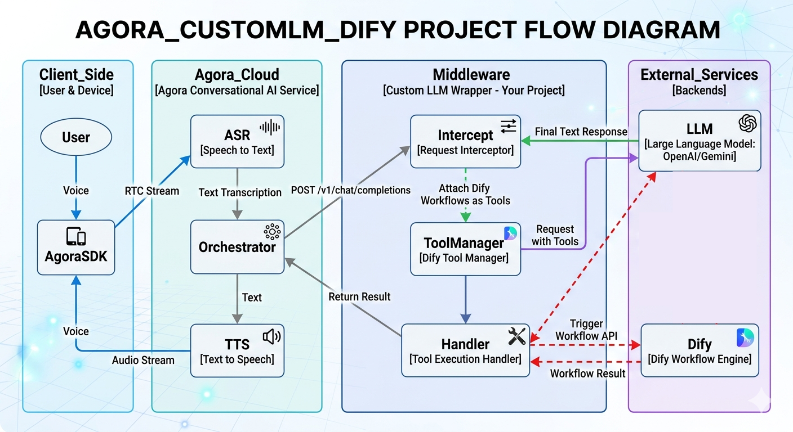

# Agora ConvoAI Custom LLM Wrapper — Dify Edition

<p align="center">
  
</p>

<p align="center">
  <a href="https://render.com/deploy?repo=https://github.com/Bac1314/Agora_CustomLLM_Dify"></a>
  &nbsp;
  <a href="https://railway.com/new/template?template=https://github.com/Bac1314/Agora_CustomLLM_Dify"></a>
  &nbsp;
  <a href="https://cloud.digitalocean.com/apps/new?repo=https://github.com/Bac1314/Agora_CustomLLM_Dify/tree/main"></a>
  &nbsp;
  <a href="https://heroku.com/deploy?template=https://github.com/Bac1314/Agora_CustomLLM_Dify"></a>
</p>

An OpenAI-compatible `/chat/completions` SSE proxy that sits between Agora ConvoAI and your upstream LLM. It registers Dify workflows as LLM-callable tools and supports two execution modes per tool:

- **`async`** (default) — fires the Dify workflow in the background, speaks a synthetic acknowledgement immediately. When Dify finishes, the result is stored in the task store and injected into the next conversation turn so the LLM delivers it via Agora's built-in `_publish_message` tool.
- **`sync`** — awaits the Dify result inline so the LLM can speak the actual answer in the same turn. Ideal for quick-response tools (weather lookups, short queries).

```
User (RTC) → Agora ConvoAI → [this wrapper] → Upstream LLM
                                    │
                          async ────┤ tool_call → Dify (background task)
                                    │                    │
                                    │    task_store ←────┘ (stores result)
                                    │         │
                                    │    next turn: LLM calls _publish_message
                                    │         └──→ Agora delivers to user app
                                    │
                           sync ────┘ tool_call → Dify (await)
                                                       │
                                      real result → 2nd LLM call → spoken aloud
```

## Requirements

- Python 3.9–3.13 (3.11+ recommended; see note below)
- An OpenAI-compatible LLM API (OpenAI, Azure, Groq, Ollama, …)
- A Dify account/deployment with at least one Workflow or Chatflow app
- An Agora account with App ID

> **Python 3.14 notice:** The codebase uses legacy `typing` generics (`Dict`, `List`, `Optional`, `Union`, etc.) that are scheduled for removal in Python 3.14. No action is needed today, but a migration to built-in generics (`dict`, `list`, `str | None`) will be required before upgrading to Python 3.14.

## Setup

```bash
# 1. Create and activate a virtual environment
python3 -m venv .venv && source .venv/bin/activate

# 2. Install dependencies
pip install -r requirements.txt

# 3. Configure environment
cp .env.example .env
# Edit .env — fill in OPENAI_API_KEY and DIFY_* keys

# 4. Configure tools
# Edit config/tools.yaml — see inline comments and the example entry
```

## Running locally

```bash
./run.sh           # production mode
./run.sh --reload  # auto-reload on code changes
```

Health check:
```bash
curl http://localhost:8000/health
```

Test with a sample Agora-shaped request:
```bash
curl -N -X POST http://localhost:8000/chat/completions \
  -H "Content-Type: application/json" \
  -d @tests/fixtures/agora_request.json
```

## Running with Docker

```bash
cp .env.example .env   # fill in your keys
docker compose up --build
curl http://localhost:8000/health
```

### Using the pre-built image

Skip the build step entirely — pull the published image from GHCR:

```bash
docker run --rm -p 8000:8000 \
  --env-file .env \
  ghcr.io/bac1314/agora-custom-llm-dify:latest
```

To use a specific release:

```bash
docker run --rm -p 8000:8000 \
  --env-file .env \
  ghcr.io/bac1314/agora-custom-llm-dify:v1.0.0
```

Available tags: `latest` (tracks `main`), `sha-<short>` (per commit), `v<version>` (per tag). Images are published for both `linux/amd64` and `linux/arm64`.

## Running tests

```bash
pip install pytest pytest-asyncio respx
pytest tests/ -v
```

## Deployment

### One-click deploy

Click a button above (or below) — the provider reads the config from this repo and prompts you for secrets in its dashboard:

| Provider | Button / command | Config file |
|---|---|---|
| **Render** | [](https://render.com/deploy?repo=https://github.com/Bac1314/Agora_CustomLLM_Dify) | `render.yaml` |
| **Railway** | [](https://railway.com/new/template?template=https://github.com/Bac1314/Agora_CustomLLM_Dify) | `railway.toml` |
| **DigitalOcean** | [](https://cloud.digitalocean.com/apps/new?repo=https://github.com/Bac1314/Agora_CustomLLM_Dify/tree/main) | `.do/app.yaml` |
| **Heroku-style** | [](https://heroku.com/deploy?template=https://github.com/Bac1314/Agora_CustomLLM_Dify) | `app.json` + `Procfile` |
| **Fly.io** | `fly launch --copy-config` | `fly.toml` |

### Manual / self-hosted

See the **[Guide](Guide)** file for step-by-step instructions for every major provider.

| Provider | Type | Config file |
|---|---|---|
| **AWS EC2 / Lightsail** | VM | `deploy/custom-llm.service` (systemd) |
| **AWS ECS / Fargate** | Container | `Dockerfile` + ECR |
| **Google Cloud Run** | Serverless | `Dockerfile` + `gcloud run deploy` |
| **Coolify / Dokku** | Self-hosted PaaS | `Dockerfile` or `Procfile` |

All providers share the same `Dockerfile`. Set env vars from `.env.example` in your provider's secrets/environment panel.

## Pointing Agora ConvoAI at this wrapper

Use the Agora ConvoAI REST API to start an agent. The key fields are explained below:

```json
{
  "name": "my_agent_name",
  "properties": {
    "channel": "<RTC channel name>",
    "token": "",
    "agent_rtc_uid": "<agent UID>",
    "remote_rtc_uids": ["*"],
    "enable_string_uid": false,
    "idle_timeout": 30,

    "llm": {
      "url": "https://your-wrapper-host/chat/completions",
      "api_key": "<your WRAPPER_API_KEY value>",
      "system_messages": [
        {
          "role": "system",
          "content": "You are a helpful assistant. Keep answers short and concise. Only output plain text — no markdown, HTML, or emojis. This is a voice service."
        }
      ],
      "greeting_message": "How can I assist you?",
      "failure_message": "Sorry, something went wrong.",
      "params": {
        "model": "<your model name, e.g. gpt-4o-mini>",
        "app_id": "<your Agora App ID>",
        "channel_name": "<RTC channel name — must match properties.channel>",
        "user_id": "<user identifier for this session>"
      },
      "input_modalities": ["text"],
      "output_modalities": ["text"]
    },

    "tts": {
      "vendor": "microsoft",
      "params": {
        "key": "<Azure TTS key>",
        "region": "<Azure region>",
        "voice_name": "en-US-AvaMultilingualNeural"
      }
    },

    "asr": {
      "vendor": "ares",
      "language": "en-US"
    },

    "advanced_features": {
      "enable_aivadmd": true,
      "enable_bhvs": true,
      "enable_rtm": false,
      "enable_tools": true
    },

    "parameters": {
      "data_channel": "datastream",
      "transcript": {
        "enable": true,
        "enable_words": false
      }
    }
  }
}
```

### Critical fields

**`llm.url`** — must point to this wrapper, not directly to OpenAI.

**`llm.params`** — Agora forwards these fields verbatim inside every `/chat/completions` request body. The wrapper reads them to key the session/task store:

| Field | Purpose |
|---|---|
| `app_id` | Your Agora App ID — used as part of the session key |
| `channel_name` | RTC channel — must match `properties.channel` |
| `user_id` | Identifies the user session; used in Dify `user_field` templates |

If these three fields are absent, the wrapper still proxies the LLM but logs a warning and task/session memory will not work.

**`advanced_features.enable_tools: true`** — required to enable Agora's built-in `_publish_message` tool. Async-mode Dify results are delivered by having the LLM call `_publish_message`; without this flag async delivery silently does nothing.

**`parameters.data_channel: "datastream"` + `transcript.enable: true`** — required for the client app to receive `_publish_message` payloads. Agora pushes the message payload over the RTC data stream channel; your client SDK must listen on that channel to receive it.

## Adding a new Dify tool

Edit `config/tools.yaml` — **no code changes required**:

```yaml
tools:
  - name: my_new_tool
    description: "Describe what this tool does and when the LLM should use it."
    parameters:
      type: object
      properties:
        my_arg:
          type: string
          description: "What this argument is"
      required: [my_arg]
    dify:
      endpoint: workflow               # "workflow" or "chat"
      base_url: https://api.dify.ai/v1
      api_key_env: DIFY_MY_TOOL_KEY    # env var name — add to .env
      input_mapping:
        my_arg: my_arg                 # LLM arg name → Dify input variable name
      user_field: "{user_id}"
    synthetic_ack: "I'm on it — I'll get back to you shortly."
    mode: async                        # "async" (default) or "sync"
```

Add the key to `.env`:
```
DIFY_MY_TOOL_KEY=app-xxxxxxxxxxxx
```

Restart the server. The new tool is immediately available to the LLM.

**Choosing a mode:**

| `mode` | When to use | LLM behaviour |
|---|---|---|
| `async` | Long-running tasks (search, analysis, > ~2s) | Speaks `synthetic_ack` immediately; real result delivered via `_publish_message` on next turn |
| `sync` | Quick lookups (weather, short queries, < ~2s) | Awaits Dify result, then speaks the actual answer in the same turn |

## Environment variables

| Variable | Description |
|---|---|
| `OPENAI_BASE_URL` | OpenAI-compatible base URL (default: `https://api.openai.com/v1`) |
| `OPENAI_API_KEY` | API key for the upstream LLM |
| `OPENAI_MODEL` | Model name (default: `gpt-4o-mini`) |
| `OPENAI_API_VERSION` | API version query param — only needed for Azure OpenAI |
| `WRAPPER_API_KEY` | Protects `/chat/completions` — requests must send `Authorization: Bearer <key>`. Leave blank to disable auth. |
| `AGORA_APP_ID` | Agora App ID — optional, used for session keying if not sent per-request |
| `AGORA_APP_CERTIFICATE` | Agora App Certificate — optional |
| `DIFY_*_API_KEY` | Per-tool Dify API keys — names referenced via `api_key_env` in `tools.yaml` |
| `APP_HOST` | Bind address (default: `0.0.0.0`) |
| `APP_PORT` | Port (default: `8000`) |
| `TOOLS_CONFIG` | Path to tools YAML (default: `config/tools.yaml`) |
| `LOG_LEVEL` | Log level (default: `INFO`) |

## Architecture

### Key components

| File | Responsibility |
|---|---|
| `app/main.py` | FastAPI app, `/chat/completions` endpoint, lifespan |
| `app/stream_handler.py` | SSE pass-through, tool-call interception, 2-pass LLM flow, sync/async branching |
| `app/task_store.py` | In-memory per-session background task tracker; surfaces completed Dify results for next-turn injection |
| `app/session_store.py` | Per-session system notes; consumed and cleared on the next request's message merge |
| `app/tool_registry.py` | Loads `config/tools.yaml`, builds OpenAI function schemas, dispatches to Dify |
| `app/dify_client.py` | Async httpx calls to Dify `/workflows/run` and `/chat-messages` |
| `app/schemas.py` | Pydantic models (OpenAI-compatible request/response) |
| `app/settings.py` | Env-var configuration via pydantic-settings |
| `config/tools.yaml` | Dify tool registry — the only file you need to edit to add a tool |

### Request flow (summary)

```
POST /chat/completions
  ├─ Merge session notes + inject task store state
  ├─ [1st LLM call] stream chunks to client
  └─ On tool_calls finish:
      ├─ async tool → synthetic ack + background Dify task + [2nd LLM call]
      ├─ sync tool  → await Dify + real result + [2nd LLM call]
      └─ non-Dify tool (_publish_message, etc.) → forward finish chunk to Agora as-is
```

See `CLAUDE.md` for the full annotated flow diagram.
